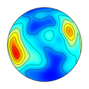
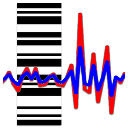

# vollmerf

Software projects written and maintained by Frederick W. Vollmer.

## Free Software

The following software is free, with the stipulation that citation be given for usage as noted in the user manuals. These are available in compiled form for Windows, macOS, and Linux platforms.

---

[Orient](orient/) is for analyzing data that can be described by an axis or direction, or by a position on a sphere. Examples include latitude and longitude, star locations, bedding planes, fold axes, fault slip directions, paleomagnetic vectors, glacial striations, crystallographic axes, current flow directions, and animal migration paths.

---

[EllipseFit](ellipsefit/) is an integrated program for two and three-dimensional geologic fabric and finite strain analysis. It includes routines to digitize and analyze collections of points, lines, ellipses, and shapes to determine mean fabric and finite strain ellipses from oriented photographs.

---

[Antevs](antevs/) is a program for analyzing varve, tree-ring, and other time-series data. Fourier analysis, and other curve fitting algorithms, are used to remove trends and to normalize the data for comparison. The resulting data series are correlated using cross-correlation techniques to identify potential matches. 

--- 

## Open Software

The following are open source software. Citation should be given for their usage, see the accompanying CITATION.md files. 

[SphereContour](spherecontour/) C, Pascal, and MATLAB/Octave versions of a program for automatic contouring of spherical orientation data using a modified Kamb method to create spherical projections including Schmidt (equal-area) and stereographic (equal-angle) plots. 

[HyperContour](hypercontour/) MATLAB/Octave script for contouring geologic fabric and finite strain data on the unit hyperboloid, including Rf/phi, Elliott polar, and equal-area fabric plots. 

---

19 Jul 2020