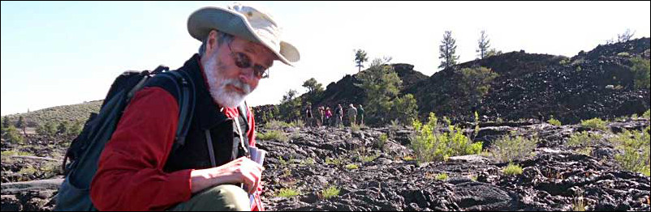

Dr. Frederick W. Vollmer  
Professor, Structural Geology

---

I am a quantitative field-based structural geologist who is fascinated by the dynamic processes of mountain building, faulting, folding, and rock deformation, processes driven by plate tectonics and manifested by uplift, earthquakes, and volcanism. 

In the early 1980s I began using computers to quantify structural data sets that  consist of three dimensional orientations and locations of linear and planar elements, and the measurement of rock fabric and strain. Over decades the software evolved to address many additional problems of interest to field geologists, and to attach statistical significance to the analyses.

As a professor at a primarily undergraduate institution, an additional objective is to make the software easy to use, and to allow data visualization, in addition to being a definitive and reliable resource for researchers. The software is free, some is open source, with the goal to be completely open source.

[Software](software/) - Free and open source software projects  

## Free Software
[Orient](orient/) - Spherical Data Analysis Software  
[EllipseFit](ellipsefit/) - Strain and Fabric Analysis Software  
[Antevs](antevs/) - Natural Time-Series Analysis Software  

## MATLAB Scripts and Open Code
[SphereContour](spherecontour/) - MATLAB, C, and Pascal code from Vollmer (1995)  
[HyperContour](hypercontour/) - MATLAB code from Vollmer (2018)  
[TriFabPlot](trifabplot/) - MATLAB code from Vollmer (1989, 1990, 2020)

---

Home | [Software](software/) | [Orient](orient/) | [EllipseFit](ellipsefit/) | [Antevs](antevs/) | [Donate](donate/)

| 10 Aug 2020 |