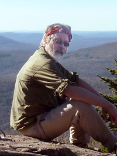

# vollmerf

Dr. Frederick W. Vollmer /
Professor /
Department of Geology, SUNY New Paltz 

# About Me

I am a quantitative field-based structural geologist who is fascinated by the dynamic processes of mountain building, faulting, folding, and rock deformation, processes driven by plate tectonics and manifested by uplift, earthquakes and volcanism. 

Beginning in the early 1980s, I began using computers to objectively quantify structural data sets, which consist of the three dimensional orientations and locations of lines, planes, objects, and the measurement of rock fabric and strain. Over the years the software evolved to address many additional problems of interest to field geologists, and to attach statistical significance to the analyses.

As a teacher at a primarily undergraduate institution, and an additional objective is to make it approachable to students, and allow data visualization, in addition to being useful to researchers. The software is free, some is open source, with the goal to be completely open source. 

---

[Software](software/) - Free and open source software projects.

---

29 Jul 2020