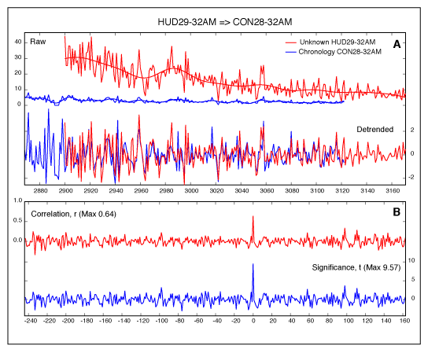

# Antevs 
Natural Time-Series Analysis Software

Antevs is a user friendly professional tool for correlating natural time-series. These arise where a value is measured through time at discrete intervals. Annual intervals commonly occur in natural systems due to seasonal variations in temperature, as displayed in proglacial varves, tree-rings, and glacial ice. Correlation is done by comparing an undated times-series to a previously dated chronology.

Antevs was developed for the correlation of proglacial varve sequences (Rayburn and Vollmer, 2013), but includes standard techniques for matching tree-rings, and can convert files between varve and tree-ring formats. It includes routines for reading the Velmex UniSlide digital readout used for digitizing tree-ring measurements. Missing data due to broken or incomplete cores is a common problem in natural data, so Antevs includes interactive procedures to correlate such sequences. 

Antevs undergoes extensive testing by varve and tree-ring researchers, including undergraduates, working in John Rayburn's varve and tree-ring laboratory at SUNY New Paltz. Antevs is compiled natively for Macintosh, Windows, and Linux, and does not require any additional libraries or interpreters. 

Antevs is written by Frederick W. Vollmer. It is free software, but may not be redistributed or posted online without the author's permission. Any significant usage, such as a resulting presentation or publication, must include attribution. This program is distributed without any warranty; without even the implied warranty of merchantability or fitness for a particular purpose.

Antevs is compiled natively on Macintosh, Windows, and Linux platforms, and does not require any additional components or installations. If you find the software useful, please consider making a [donation](../donate/) to support its continued development.  

Please read the accompanying [Antevs User Manual](https://www.frederickvollmer.com/antevs/download/Antevs_User_Manual.pdf) for license and additional information.

## Example Correlation

(A) Hudson and Connecticut River Valley raw (top) and detrended (bottom) North American Varve Chronology (NAVC) data. The raw data is detrended using a 16 term Fourier filter to remove long wavelength variations, and standardized to account for thickness variations between proxmal and distal varves.

(B) Correlogram produced by cross-correlation of the detrended data. The correlogram shows a spike corresponding to a match at 0 years offset, with a correlation of r = 0.64, and significance t = 9.57.

Modified from Rayburn and Vollmer, 2013.

---

## Antevs Downloads

* Antev downloads are hosted on [FrederickVollmer.com](http://www.frederickvollmer.com)
[Antevs](http://www.frederickvollmer.com/antevs/)

---

[Home](../) | [Software](../software/) | [Orient](../orient/) | [EllipseFit](../ellipsefit/) | Antevs | [Donate](../donate/)	

| 14 May 2022 |

