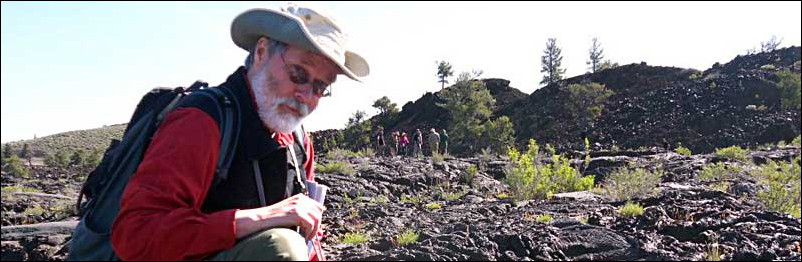

Dr. Frederick W. Vollmer  
Professor, Structural Geology

---

# Donate

The software hosted on this site ("Doc V Software Project") is <i>free</i> to download and use. There are no ads, popups, or links to products for sale. The software is maintained by myself (Frederick W. Vollmer) out of scholarly and academic interest, with no funding or support from university or other sources. 

The software has thousands of users at academic institutions, public and private agencies, and in industry and consulting. Rather than charging a fee, I have elected to offer it for <i>free</i>, and to move towards an open source model. The only stipulation is that citations of the author's work be included in publications containing content created by the software or derivative works.

While the software is <i>free</i>, I greatly appreciate donations. Donations are used to defray costs of software development and website hosting, and allow me to continue offering free software. The PayPal link below allows a secure donation to be made in US dollars. You do not need a PayPal account for a one time donation, an account is required to make monthly donations.[^1] 

---

[^1]: Legal notice: By making a donation to the Doc V Software Project you signify that you acknowledged, understood, accepted, and agreed to the terms and conditions contained in this notice. Your donation to the Doc V Software Project is voluntary and is not a fee for any services, goods, or advantages, and making a donation to the Doc V Software Project does not entitle you to any services, goods, or advantages. We have the right to use the money you donate to the Doc V Software Project in any lawful way and for any lawful purpose we see fit and we are not obligated to disclose the way and purpose to any party unless required by applicable law. Although the Doc V Software Project is free software, to our best knowledge the Doc V Software Project does not have any tax exempt status (the Doc V Software Project is neither a registered non-profit corporation nor a registered charity in any country). Your donation may or may not be tax-deductible, please consult this with your tax advisor. We will not publish or disclose your name or e-mail address without your consent, unless required by applicable law. Your donation is non-refundable.

---

[Home](../) | [Software](../software/) | [Orient](../orient/) | [EllipseFit](../ellipsefit/) | [Antevs](../antevs/) | Donate

| 13 Aug 2020 |