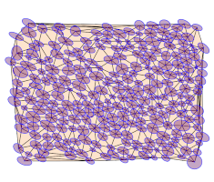

# EllipseFit
Strain and Fabric Analysis Software	

---

EllipseFit is an integrated program for geologic fabric and finite strain analysis. It is used to derive two and three-dimensional strain from oriented photographs of thin sections, hand samples, or outcrop surfaces, and is designed for laboratory and field based structural geology studies. The intuitive graphical interface and multi-platform deployment also make it ideal for teaching introductory or advanced structural geology laboratories.

 &nbsp; &nbsp; &nbsp; &nbsp; &nbsp; &nbsp; &nbsp; &nbsp; &nbsp; &nbsp; &nbsp; &nbsp; &nbsp; &nbsp; &nbsp; &nbsp;

Images of oriented sections can be digitized using center-point, ellipse, shape, and filled shape methods. Shape fitting and filling, using moment-equivalent ellipses, allows a wide range of geological objects to be analysed, including ooids, pebbles, fossils, and irregular clasts. Fabric analysis techniques include Fry plots, polar Elliott, Rf/Φ plots, strain maps, and polar and cylindrical hyperboloidal projections with automatic contouring.

Best-fit ellipse calculations include shape-matrix eigenvalue, mean radial length, and hyperboloidal vector mean, error analysis is done analytically and using bootstrap techniques. The initial data set can be unstrained to check variation in the calculated pre-strain fabric.

 &nbsp; &nbsp; &nbsp; &nbsp; &nbsp; &nbsp; &nbsp; &nbsp; &nbsp; &nbsp; &nbsp; &nbsp; &nbsp; &nbsp; &nbsp; &nbsp;

Fitting of ellipse-section data to a best-fit ellipsoid is done using the shape-matrix techniques of Robin and Shan. Error analysis is done by calculating the section ellipses, comparing the misfits between calculated and observed section ellipses, and by bootstrap statistics.

Graphical displays of ellipsoid data include Flinn, Ramsay, and Nadai-Hsu plots. Data can be directly digitized from photographs, or can be imported using comma delimited, tab delimited, Excel and LibreOffice spreadsheet files. Plots can be exported as bitmap images in various formats, or as vector graphics files which can be imported into graphics editing programs, such as Adobe Illustrator and Inkscape.

 &nbsp; &nbsp; &nbsp; &nbsp; &nbsp; &nbsp; &nbsp; &nbsp; &nbsp; &nbsp; &nbsp; &nbsp; &nbsp; &nbsp;

EllipseFit functionalities include:

* Digitizing points, quadrilaterals, ellipses, and shapes
* Fry-type analysis with void-fitting and error analysis
* Automated Wellman analysis for fossils
* Mean ellipse calculations with bootstrap confidence
* Contoured fabric plots including Rf/ϕ, Elliott polar, and equal-area
* Delaunay triangulation and strain maps
* Fabric data transformation and synthesis
* Flinn-Ramsay, Nadai-Hsu, and ellipsoid shade plots
* Robin and Shan ellipsoid calculations with error analysis
* Strain from displacements, strain probe, and stretch plots

EllipseFit is written by Frederick W. Vollmer. It is free software, but may not be redistributed or posted online without the author's permission. Any significant usage, such as a resulting presentation or publication, must include attribution. This program is distributed without any warranty; without even the implied warranty of merchantability or fitness for a particular purpose. 

Please read the accompanying [EllipseFit User Manual](https://www.frederickvollmer.com/ellipsefit/download/EllipseFit_User_Manual.pdf) for license and additional information.

 &nbsp; &nbsp; &nbsp; &nbsp; &nbsp; &nbsp; &nbsp; &nbsp; &nbsp; &nbsp; &nbsp; &nbsp; &nbsp; &nbsp; &nbsp; &nbsp;

## EllipseFit Downloads

The current version of EllipseFit is 3.8.0.

* [Linux 3.8.0](http://www.frederickvollmer.com/ellipsefit/download.php?file=EllipseFit_3.8.0_Lin.tgz)
* [Macintosh 3.8.0](http://www.frederickvollmer.com/ellipsefit/download.php?file=EllipseFit_3.8.0_Mac.dmg)
* [Windows 3.8.0](http://www.frederickvollmer.com/ellipsefit/download.php?file=EllipseFit_3.8.0_Win.zip) 

## EllipseFit sha256

sha256 file checksums are provided in case you or you network administrator desire to verify the integrity of the downloaded files. 

* [Linux 3.8.0](http://www.frederickvollmer.com/ellipsefit/download.php?file=EllipseFit_3.8.0_Lin.tgz.sha256) 
* [Macintosh 3.8.0](http://www.frederickvollmer.com/ellipsefit/download.php?file=EllipseFit_3.8.0_Mac.dmg.sha256) 
* [Windows 3.8.0](http://www.frederickvollmer.com/ellipsefit/download.php?file=EllipseFit_3.8.0_Win.zip.sha256) 

--- 

[Home](../) | [Software](../software/) | [Orient](../orient/) | EllipseFit | [Antevs](../antevs/)

---

| 29 July 2020 |

