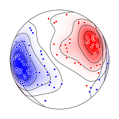
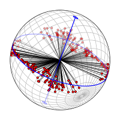

# Orient 

Orient is a fast, easy to use, professional spherical projection and directional data analysis program. Orient has been in development since 1986, when it introduced modified Kamb contouring, triangular fabric diagrams, and automated structural domain analysis. Numerous new tools include interactive data analysis, UTM conversions, digitizing, bootstrap statistics, cluster analysis, ternary plots, fault inversion, and file level integration with applications such as Microsoft Excel, LibreOffice, Adobe Illustrator, InkScape, CorelDRAW, StraboSpot, Global CMT Project, and Google Earth.

Orient is for plotting and analyzing data that can be described by an axis or direction in space. Examples include bedding planes, faults and slip directions, fold axes, paleomagnetic vectors, glacial striations, current flow directions, crystallographic axes, earthquake epicenters, cosmic ray arrival directions, comet orbital planes, and animal migration paths. Orient has been written to apply to a wide variety data types, however many examples come from geology, which requires extensive manipulation and analysis of orientation data. Data input formats include longitude and latitude, azimuth and altitude, declination and inclination, trend and plunge, strike and dip, dip and dip direction, and others.

---

---

Spherical projection functionalities include:

* Schmidt net (equal-area) spherical projections
* Stereonet (Wulff) spherical projections
* Upper, lower, and dual hemisphere projections
* Modified Kamb contouring of density on the sphere
* Density, MUD, and probability contour intervals
* Eigenvector and mean vector calculations
* von Mises-Fisher, Kent, Watson, and Bingham cones
* Bootstrap cones and statistics
* Data, net, and projection rotations
* Best fit to conical data with statistics
* Kinematic and dynamic fault and shear zone analysis
* Axis, vector, and girdle cluster analysis
* Spherical kernel density estimation

Additional functionalities include:

* Circular histograms and frequency polygons
* Triangular eigenvector PGR fabric plots
* UTM, latitude, longitude conversions
* Digitizing directional data from maps and projections
* Fault quarter dip and rake histograms
* Fault moment tensor triangle plots
* Trend surface analysis
* Google Earth, StraboSpot, and Global CMT Project integration
* Orientation fields and structural domain analysis
* Terzaghi scan line weight correction
* Ternary compositional plots
* Triangular kernel density estimation

Orient is written by Frederick W. Vollmer. It is free software, but may not be redistributed or posted online without the author's permission. Any significant usage, such as a resulting presentation or publication, must include attribution. This program is distributed without any warranty; without even the implied warranty of merchantability or fitness for a particular purpose. 

Orient is natively compiled on Macintosh, Windows, and Linux platforms, and does not require any additional components or installations. 

Please read the accompanying [Orient User Manual](https://www.frederickvollmer.com/orient/download/Orient_User_Manual.pdf) for license and additional information.

## Orient 1.5.0 Downloads

* [Linux](http://www.frederickvollmer.com/orient/download.php?file=Orient_3.12.0_Lin.tgz)
* [Macintosh](http://www.frederickvollmer.com/orient/download.php?file=Orient_3.12.0_Mac.dmg)
* [Windows](http://www.frederickvollmer.com/orient/download.php?file=Orient_3.12.0_Win.zip) 

## Orient 1.5.0 SHA256

SHA256 file checksums are provided in case you or you network administrator desire to verify the integrity of the downloaded files. 

* [Linux](http://www.frederickvollmer.com/orient/download.php?file=Orient_3.12.0_Lin.tgz.sha256) 
* [Macintosh](http://www.frederickvollmer.com/orient/download.php?file=Orient_3.12.0_Mac.dmg.sha256) 
* [Windows](http://www.frederickvollmer.com/orient/download.php?file=Orient_3.12.0_Win.zip.sha256) 

---

--- 

[vollmerf home](../)

18 July 2020

