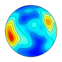

# vollmerf

Software projects written and maintained by Frederick W. Vollmer.

## Free Software

The following software is free, with the stipulation that citation be given for usage as noted in the user manuals. These are available in compiled form for Windows, macOS, and Linux platforms.

---

[Orient](https://www.frederickvollmer.com/orient/) is for analyzing data that can be described by an axis or direction, or by a position on a sphere. Examples include latitude and longitude, star locations, bedding planes, fold axes, fault slip directions, paleomagnetic vectors, glacial striations, crystallographic axes, current flow directions, and animal migration paths.

---
