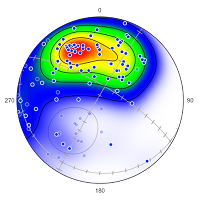

# Orient 
Spherical Data Analysis Software

---

Orient is an easy to use, professional spherical projection and directional data analysis program. Orient has been in development since 1986, when it introduced modified Kamb contouring, triangular fabric diagrams, and automated structural domain analysis. New tools include interactive data analysis, UTM conversion, digitizing, bootstrap statistics, cluster analysis, ternary plots, fault inversion, and file level integration with applications such as Microsoft Excel, LibreOffice, Adobe Illustrator, InkScape, CorelDRAW, StraboSpot, Global CMT Project, and Google Earth.

Orient is for plotting and analyzing data that can be described by an axis or direction in space. Examples include bedding planes, faults and slip directions, fold axes, paleomagnetic vectors, glacial striations, current flow directions, crystallographic axes, earthquake epicenters, comet orbital planes, and animal migration paths. Orient can work with a wide variety data types, data input formats include longitude and latitude, azimuth and altitude, declination and inclination, trend and plunge, strike and dip, dip and dip direction, and others.

 | 

Spherical projection functionalities include:

* Schmidt net, equal-area projection
* Stereonet, equal angle projection
* Upper, lower, and dual hemisphere 
* Modified Kamb contouring 
* Density, MUD, and probability contours
* Eigenvector and mean vectors
* Fisher, Kent, Watson, and Bingham cones
* Bootstrap cones and statistics
* Data, net, and projection rotations
* Circular cone fitting with statistics
* Elliptical cone fitting with statistics
* Kinematic and dynamic fault analysis
* Axis, vector, and girdle cluster analysis

Additional functionalities include:

* Circular histograms and frequency polygons
* Triangular eigenvector PGR fabric plots
* UTM, latitude, longitude conversions
* Frame statistics and rotation plots
* Digitizing directional data
* Fault quarter dip and rake histograms
* Fault moment tensor triangle plots
* Trend surface analysis
* Google Maps and Google Earth integration	
* StraboSpot and Global CMT Project import	
* Orientation fields and domain analysis
* Terzaghi scan line weight correction
* Ternary compositional plots

Orient is written by Frederick W. Vollmer. It is free, but may not be redistributed or posted online without the author's permission. Any significant usage, such as a resulting presentation or publication, must include attribution. This program is distributed without any warranty; without even the implied warranty of merchantability or fitness for a particular purpose. 

Orient is compiled natively on Macintosh, Windows, and Linux Ubuntu platforms, and does not require any additional components or installations. If you find the software useful, please consider making a [donation](../donate/) to support its continued development. 

Please read the accompanying [Orient User Manual](https://www.frederickvollmer.com/orient/download/Orient_User_Manual.pdf) for license and additional information.

---

## Orient Downloads

* Orient downloads are hosted on [FrederickVollmer.com](http://www.frederickvollmer.com) and [vollmerf.com](http://www.vollmerf.com)

---

 | 

--- 

[Home](../) | [Software](../software/) | Orient | [EllipseFit](../ellipsefit/) | [Antevs](../antevs/) | [Donate](../donate/)	

| 20 Jan 2023 |
