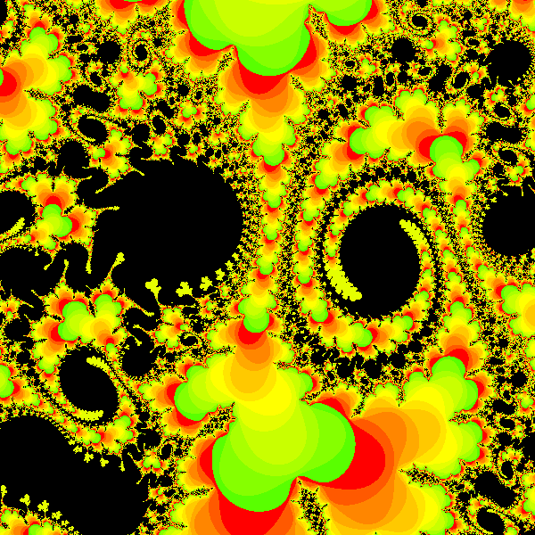
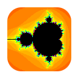
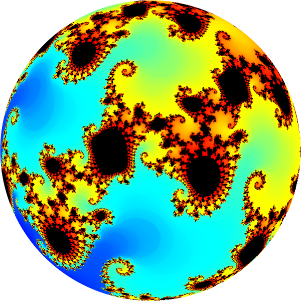

# ZFract #
Fractal Visualization Software 

---

ZFract is a fast compact open source fractal image generator for Mandlebrot and Julia sets. These sets exist in the complex number plane, represented with real components on the X axis, and imaginary components on the Y axis. Inclusion within a set is defined by an iterative equation, f(z) = z*z + c, that does not diverge to infinity. Points outside a set have an escape count, the number of iterations required to diverge, a measure of closeness to the set.

Coloring the image is done using a selected color palette. Each pixel represents a complex number, and is colored using the escape count. ZFract has a help command which displays a page on usage, commands, and settings. The source of the help text is in the file "help.inc".

--- 

---

## License ##

ZFract is free software; you can redistribute it and/or modify it under the terms of the GNU General Public License as published by the Free Software Foundation; either version 2 of the License, or (at your option) any later version.

ZFract is distributed in the hope that it will be useful, but WITHOUT ANY WARRANTY; without even the implied warranty of MERCHANTABILITY or FITNESS FOR A PARTICULAR PURPOSE. See the GNU General Public License for more details.

You should have received a copy of the GNU General Public License along with ZFract, if not, see <https://www.gnu.org/licenses/>.

## Citation ##
Please cite the usage of this or derivative software using: 

* Vollmer, F.W., 2023. ZFract: Fractal Visualization Software. https://github.com/vollmerf/zfract

## Links ##

* [vollmerf home](https://vollmerf.github.io/)
* [vollmerf repositories](https://github.com/vollmerf)

## Acknowledgements
* Inspired by A.K. Dewdney's August 1985 Computer Recreations column in Scientific American, p. 16-24. 
* Thanks to the Free Pascal, Lazarus, and BGRABitmap developers.

---

[Home](../) | [Software](../software/) | [Orient](../orient/) | [EllipseFit](../ellipsefit/) | [Antevs](../antevs/) | ZFract | [Donate](../donate/)	

| 13 Feb 2023 |
